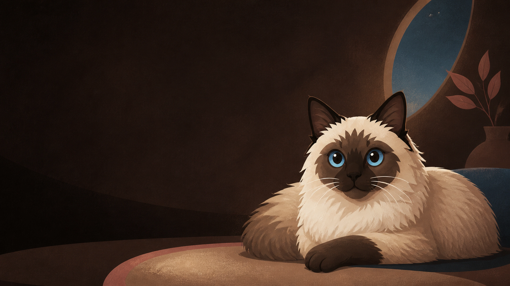
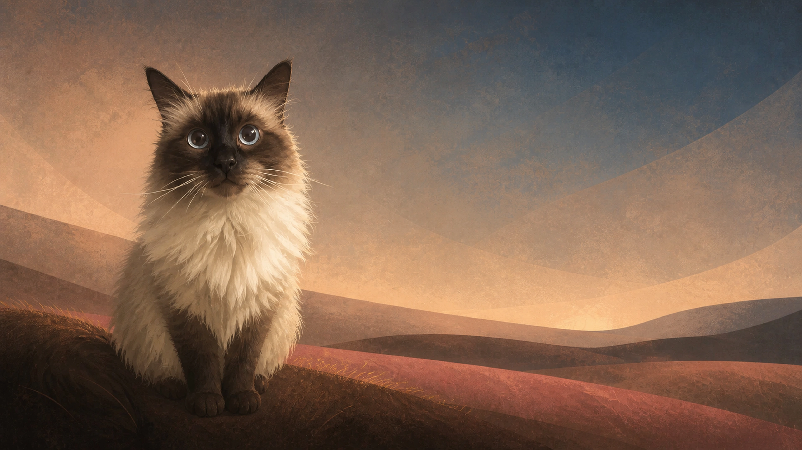
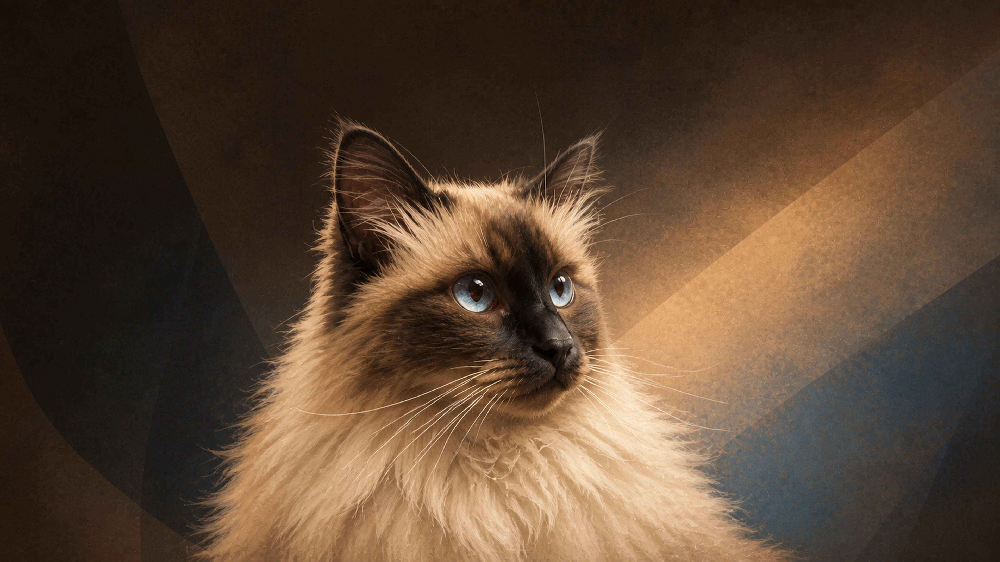

<p align="center">
  
</p>

<h1 align="center">Baziu</h1>

<p align="center">
  A warm, cat-inspired theme for <a href="https://omarchy.org/">Omarchy</a>, created in memory of Baziu.
</p>

## In memory of Baziu

Baziu was a Neva Masquerade cat (2007–2025): sweet, cuddly, sharp,
temperamental, and wonderfully opinionated. He inspired
[Bazilion](https://github.com/rullopat/bazilion), and now this theme carries a
little of him into the desktop too.

The theme's **Mask & Moonlight** palette turns his seal-point coloring into a
warm dark interface: chocolate surfaces, cream foregrounds, a small touch of
dusty rose, and sapphire blue reserved for the brightest accents—like his eyes.

## Install

Baziu requires **Omarchy 4 / Quattro** and was first tested on Omarchy 4.0.1.
Install it directly from GitHub:

```bash
omarchy theme install https://github.com/rullopat/omarchy-baziu-theme.git
```

The installer applies the theme immediately. You can return to it later with:

```bash
omarchy theme set baziu
```

## Wallpapers

The theme includes three original wallpapers:

- **Mask & Moonlight** — a quiet twilight tribute guided by Baziu's existing
  illustrated identity.
- **Sapphire Gaze** — a warm first-light companion informed by a private photo
  of Baziu, preserving his upright pose, seal mask, cream ruff, and luminous
  eyes in the same painterly style.
- **Golden Watch** — a close late-afternoon portrait informed by another
  private photo, capturing his attentive side gaze, magnificent ruff, tufted
  ears, and fine white whiskers.

Only the finished photo-informed artworks are published; their private
reference photographs are not included in this repository.

<p align="center">
  
</p>

<p align="center">
  
</p>

Cycle through the available backgrounds with:

```bash
omarchy theme bg next
```

### Add personal photos without publishing them

Private backgrounds do not need to be committed to this public repository.
Put them in Omarchy's per-user background directory instead:

```bash
mkdir -p ~/.config/omarchy/backgrounds/baziu
cp /path/to/baziu-photo.jpg ~/.config/omarchy/backgrounds/baziu/
omarchy theme bg next
```

Omarchy includes that directory in Baziu's background switcher alongside the
wallpapers shipped by the theme.

## Palette

| Role | Color | Hex |
|:--|:--|:--|
| Background | Deep chocolate | `#1A140F` |
| Surface | Warm dark brown | `#2A211A` |
| Foreground | Cream fur | `#F5F0E8` |
| Muted | Deep mocha | `#7A6555` |
| Secondary foreground | Warm mocha | `#A89789` |
| Accent | Sapphire eye | `#7BB4D2` |
| Bright accent | Sapphire light | `#A0CEE3` |
| Highlight | Dusty rose | `#D89A9D` |
| Success | Soft green | `#75B99A` |
| Warning | Warm ochre | `#D2A15D` |
| Error | Muted rose | `#E28A8E` |

Omarchy generates the terminal, shell, Hyprland, editor, browser, and other
application themes from [`colors.toml`](./colors.toml). The repository stays
deliberately small and contains no executable theme hooks.

## Update or remove

Update all Git-installed Omarchy themes, then restage the current one:

```bash
omarchy theme update
omarchy theme refresh
```

Remove Baziu with:

```bash
omarchy theme remove baziu
```

## Files

```text
colors.toml                         Semantic Omarchy 4 palette
backgrounds/01-mask-and-moonlight.webp  3840×2160 wallpaper
backgrounds/02-sapphire-gaze.webp   3840×2160 wallpaper
backgrounds/03-golden-watch.webp    3840×2160 wallpaper
preview.png                         Theme-picker and README preview
ARTWORK.md                          Artwork provenance and generation brief
LICENSE                             MIT license for theme configuration/docs
LICENSES/CC-BY-4.0.txt              License for the included artwork
```

## License and credits

Theme configuration and documentation are licensed under the
[MIT License](./LICENSE). The included wallpapers and the derived preview are
licensed under [CC BY 4.0](./LICENSES/CC-BY-4.0.txt); see
[`ARTWORK.md`](./ARTWORK.md) for provenance and attribution.

The original Baziu illustration used as a visual reference comes from the
MIT-licensed [Bazilion project](https://github.com/rullopat/bazilion).

In memoriam · **Baziu** · 2007–2025.
